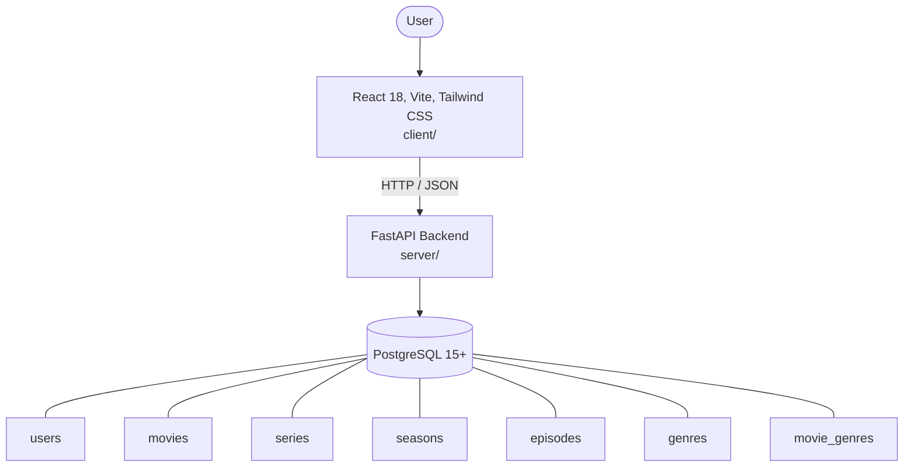

# Architecture

_Auto-generated by the SDLC Assistant from the generated codebase and the approved Feature Spec (latest: SCRUM-218). Regenerated on each push._

## System Diagram

## Tech Stack
- **language**: Python 3.11
- **backend_framework**: FastAPI
- **orm**: SQLAlchemy 2.x
- **database**: PostgreSQL 15+
- **frontend**: React 18, Vite, Tailwind CSS
- **cloud_provider**: GCP (Cloud Run & Cloud SQL)
- **constitution_section_4_followed**: True

## Backend Modules (server/)
- server/__init__.py
- server/api/__init__.py
- server/api/deps.py
- server/api/routes/__init__.py
- server/api/routes/auth.py
- server/api/routes/genres.py
- server/api/routes/movies.py
- server/api/routes/series.py
- server/database.py
- server/main.py
- server/models.py
- server/schemas.py
- server/services/__init__.py
- server/services/auth.py
- server/services/catalog.py
- server/services/movie.py
- server/services/series.py
- server/tests/__init__.py
- server/tests/conftest.py
- server/tests/test_auth.py
- server/tests/test_movies.py
- server/tests/test_series.py

## Frontend Modules (client/)
- (no client/ files found yet)

## API Endpoints
- POST /api/v1/auth/login
- GET /api/v1/movies
- GET /api/v1/movies/{id}
- POST /api/v1/movies
- PUT /api/v1/movies/{id}
- DELETE /api/v1/movies/{id}
- GET /api/v1/series
- GET /api/v1/series/{id}
- POST /api/v1/series
- POST /api/v1/series/{id}/seasons
- POST /api/v1/seasons/{id}/episodes
- GET /api/v1/genres

## Data Model
- users
- movies
- series
- seasons
- episodes
- genres
- movie_genres
