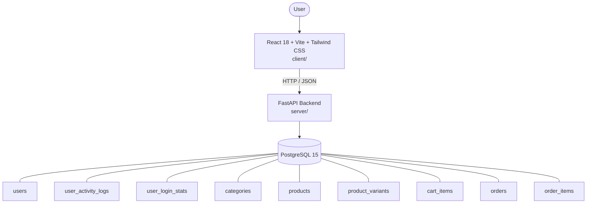

# Architecture

_Auto-generated by the SDLC Assistant from the generated codebase and the approved Feature Spec (latest: SCRUM-91). Regenerated on each push._

## System Diagram

## Tech Stack
- **language**: Python 3.11
- **backend_framework**: FastAPI
- **orm**: SQLAlchemy 2.x
- **database**: PostgreSQL 15
- **frontend**: React 18 + Vite + Tailwind CSS
- **cloud_provider**: GCP Cloud Run
- **constitution_section_4_followed**: True

## Backend Modules (server/)
- server/__init__.py
- server/conftest.py
- server/database.py
- server/dependencies/__init__.py
- server/dependencies/auth.py
- server/main.py
- server/models/__init__.py
- server/models/models.py
- server/routers/__init__.py
- server/routers/activity.py
- server/routers/cart.py
- server/routers/orders.py
- server/routers/products.py
- server/routers/users.py
- server/schemas/__init__.py
- server/schemas/schemas.py
- server/services/__init__.py
- server/services/billing_analytics.py
- server/tests/__init__.py
- server/tests/test_activity.py
- server/tests/test_cart.py
- server/tests/test_health.py
- server/tests/test_orders.py
- server/tests/test_products.py
- server/tests/test_users.py

## Frontend Modules (client/)
- client/eslint.config.js
- client/postcss.config.js
- client/src/App.jsx
- client/src/App.test.jsx
- client/src/components/cart/CartItemRow.jsx
- client/src/components/cart/OrderSummary.jsx
- client/src/components/catalog/FilterSidebar.jsx
- client/src/components/catalog/ProductCard.jsx
- client/src/components/common/Badge.jsx
- client/src/components/common/Button.jsx
- client/src/components/common/Navbar.jsx
- client/src/components/detail/ProductGallery.jsx
- client/src/components/detail/VariantSelector.jsx
- client/src/components/orders/TrackingStepper.jsx
- client/src/context/AuthContext.jsx
- client/src/context/CartContext.jsx
- client/src/main.jsx
- client/src/pages/CatalogPage.jsx
- client/src/pages/CheckoutPage.jsx
- client/src/pages/DetailPage.jsx
- client/src/pages/LoginPage.jsx
- client/src/pages/OrderHistoryPage.jsx
- client/src/pages/RegisterPage.jsx
- client/src/services/api.js
- client/src/services/api.test.js
- client/src/setup.js
- client/tailwind.config.js
- client/vite.config.js

## API Endpoints
- POST /api/v1/users/register
- POST /api/v1/users/login
- GET /api/v1/users/profile
- GET /api/v1/activity/logs
- GET /api/v1/activity/summary
- GET /api/v1/products
- GET /api/v1/products/{id}
- GET /api/v1/cart
- POST /api/v1/cart/items
- PUT /api/v1/cart/items/{item_id}
- DELETE /api/v1/cart/items/{item_id}
- POST /api/v1/orders/checkout
- GET /api/v1/orders
- GET /api/v1/orders/{id}

## Data Model
- users
- user_activity_logs
- user_login_stats
- categories
- products
- product_variants
- cart_items
- orders
- order_items
