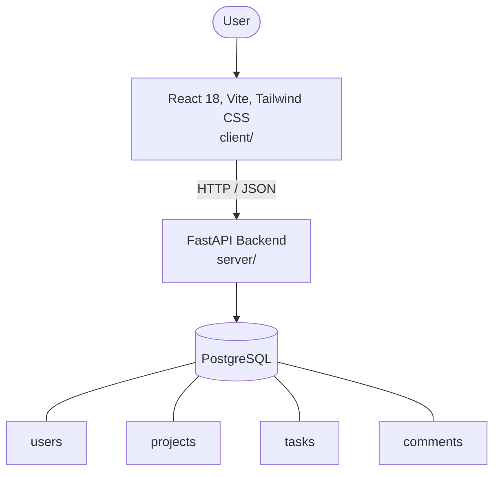

# Architecture

_Auto-generated by the SDLC Assistant from the generated codebase and the approved Feature Spec (latest: SCRUM-192). Regenerated on each push._

## System Diagram

## Tech Stack
- **language**: Python 3.11
- **backend_framework**: FastAPI
- **orm**: SQLAlchemy 2.x
- **database**: PostgreSQL
- **frontend**: React 18, Vite, Tailwind CSS
- **cloud_provider**: GCP (Cloud Run, Cloud SQL)
- **constitution_section_4_followed**: True

## Backend Modules (server/)
- server/__init__.py
- server/api/__init__.py
- server/api/v1/__init__.py
- server/api/v1/auth.py
- server/api/v1/comments.py
- server/api/v1/projects.py
- server/api/v1/tasks.py
- server/core/__init__.py
- server/core/config.py
- server/core/security.py
- server/db/__init__.py
- server/db/session.py
- server/main.py
- server/models/__init__.py
- server/models/comment.py
- server/models/project.py
- server/models/task.py
- server/models/user.py
- server/schemas/__init__.py
- server/schemas/comment.py
- server/schemas/project.py
- server/schemas/task.py
- server/schemas/user.py
- server/tests/__init__.py
- server/tests/conftest.py
- server/tests/test_auth.py
- server/tests/test_comments.py
- server/tests/test_projects.py
- server/tests/test_tasks.py

## Frontend Modules (client/)
- (no client/ files found yet)

## API Endpoints
- POST /api/v1/auth/login
- GET /api/v1/auth/me
- GET /api/v1/projects
- POST /api/v1/projects
- GET /api/v1/projects/{id}
- PUT /api/v1/projects/{id}
- DELETE /api/v1/projects/{id}
- GET /api/v1/tasks
- POST /api/v1/tasks
- GET /api/v1/tasks/{id}
- PUT /api/v1/tasks/{id}
- DELETE /api/v1/tasks/{id}
- GET /api/v1/tasks/{task_id}/comments
- POST /api/v1/tasks/{task_id}/comments
- PUT /api/v1/comments/{id}
- DELETE /api/v1/comments/{id}

## Data Model
- users
- projects
- tasks
- comments
