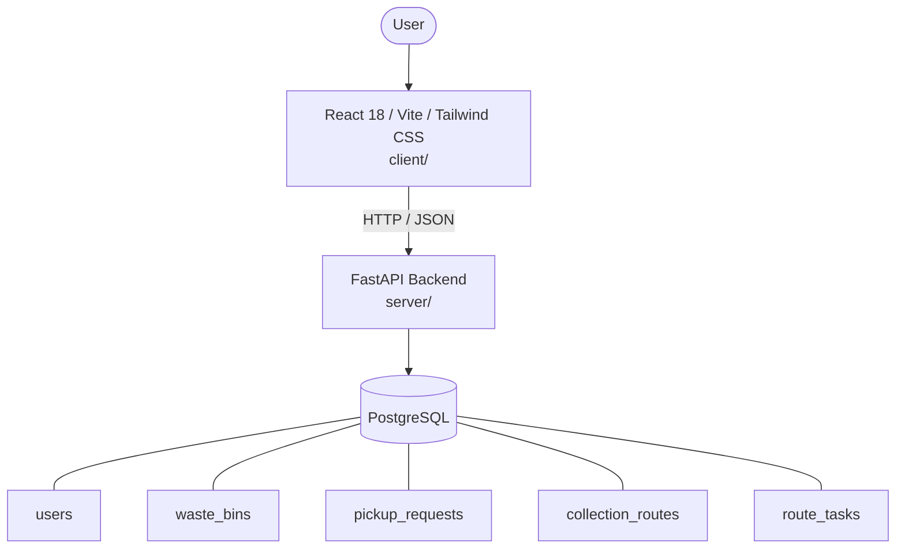

# Architecture

_Auto-generated by the SDLC Assistant from the generated codebase and the approved Feature Spec (latest: SCRUM-277). Regenerated on each push._

## System Diagram

## Tech Stack
- **language**: Python 3.11
- **backend_framework**: FastAPI
- **orm**: SQLAlchemy 2.x
- **database**: PostgreSQL
- **frontend**: React 18 / Vite / Tailwind CSS
- **cloud_provider**: Google Cloud Platform (Cloud Run)
- **constitution_section_4_followed**: True

## Backend Modules (server/)
- server/__init__.py
- server/auth.py
- server/config.py
- server/database.py
- server/main.py
- server/models.py
- server/routers/__init__.py
- server/routers/analytics.py
- server/routers/auth.py
- server/routers/bins.py
- server/routers/pickups.py
- server/routers/routes.py
- server/schemas.py
- server/tests/__init__.py
- server/tests/conftest.py
- server/tests/test_analytics.py
- server/tests/test_auth.py
- server/tests/test_bins.py
- server/tests/test_pickups.py
- server/tests/test_routes.py

## Frontend Modules (client/)
- (no client/ files found yet)

## API Endpoints
- POST /api/v1/pickups
- GET /api/v1/pickups
- GET /api/v1/bins
- POST /api/v1/bins/{id}/telemetry
- GET /api/v1/routes
- PATCH /api/v1/routes/tasks/{task_id}
- GET /api/v1/analytics/summary

## Data Model
- users
- waste_bins
- pickup_requests
- collection_routes
- route_tasks
