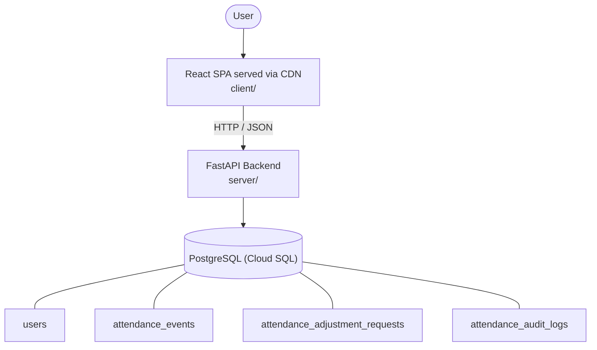

# Architecture

_Auto-generated by the SDLC Assistant from the generated codebase and the approved Feature Spec (latest: SCRUM-84). Regenerated on each push._

## System Diagram

## Tech Stack
- **language**: Python 3.11
- **backend_framework**: FastAPI
- **orm**: SQLAlchemy 2.x
- **database**: PostgreSQL (Cloud SQL)
- **frontend**: React SPA served via CDN
- **cloud_provider**: Google Cloud Platform (GCP)
- **constitution_section_4_followed**: True

## Backend Modules (server/)
- server/__init__.py
- server/database.py
- server/main.py
- server/models.py
- server/schemas.py
- server/security.py
- server/tests/__init__.py
- server/tests/conftest.py
- server/tests/test_admin.py
- server/tests/test_approvals.py
- server/tests/test_attendance.py
- server/tests/test_auth.py

## Frontend Modules (client/)
- (no client/ files found yet)

## API Endpoints
- POST /api/v1/attendance/check-in
- POST /api/v1/attendance/check-out
- GET /api/v1/attendance/history
- GET /api/v1/attendance/team
- POST /api/v1/approvals/request
- GET /api/v1/approvals/requests
- PUT /api/v1/approvals/requests/{request_id}
- PUT /api/v1/admin/attendance/{attendance_id}

## Data Model
- users
- attendance_events
- attendance_adjustment_requests
- attendance_audit_logs
