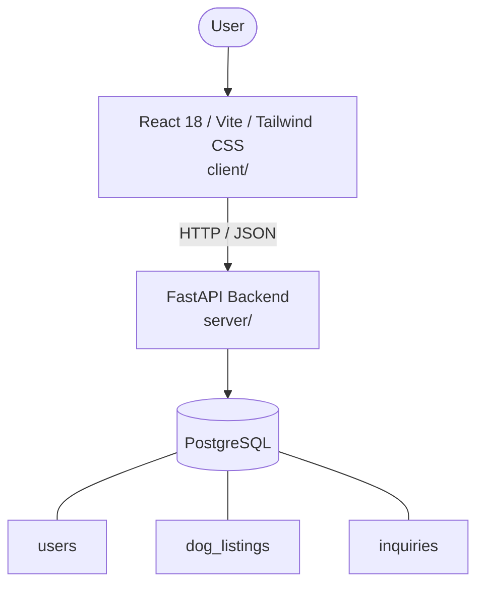

# Architecture

_Auto-generated by the SDLC Assistant from the generated codebase and the approved Feature Spec (latest: SCRUM-162). Regenerated on each push._

## System Diagram

## Tech Stack
- **language**: Python 3.11
- **backend_framework**: FastAPI
- **orm**: SQLAlchemy 2.x
- **database**: PostgreSQL
- **frontend**: React 18 / Vite / Tailwind CSS
- **cloud_provider**: GCP Cloud Run
- **constitution_section_4_followed**: True

## Backend Modules (server/)
- server/__init__.py
- server/app/__init__.py
- server/app/core/__init__.py
- server/app/core/config.py
- server/app/core/security.py
- server/app/db/__init__.py
- server/app/db/session.py
- server/app/models/__init__.py
- server/app/models/inquiry.py
- server/app/models/listing.py
- server/app/models/user.py
- server/app/routers/__init__.py
- server/app/routers/auth.py
- server/app/routers/inquiries.py
- server/app/routers/listings.py
- server/app/schemas/__init__.py
- server/app/schemas/inquiry.py
- server/app/schemas/listing.py
- server/app/schemas/user.py
- server/main.py
- server/tests/__init__.py
- server/tests/conftest.py
- server/tests/test_auth.py
- server/tests/test_inquiries.py
- server/tests/test_listings.py

## Frontend Modules (client/)
- (no client/ files found yet)

## API Endpoints
- GET /api/v1/listings
- POST /api/v1/listings
- GET /api/v1/listings/{id}
- PUT /api/v1/listings/{id}
- DELETE /api/v1/listings/{id}
- POST /api/v1/listings/{id}/inquire
- GET /api/v1/inquiries
- POST /api/v1/auth/register
- POST /api/v1/auth/login

## Data Model
- users
- dog_listings
- inquiries
