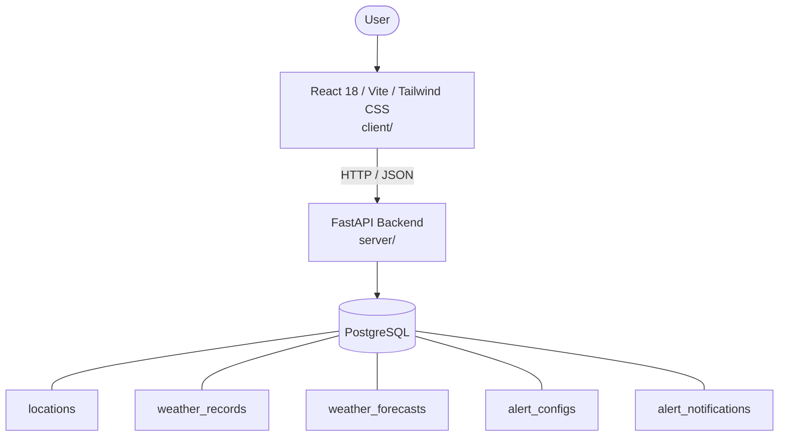

# Architecture

_Auto-generated by the SDLC Assistant from the generated codebase and the approved Feature Spec (latest: SCRUM-226). Regenerated on each push._

## System Diagram

## Tech Stack
- **language**: Python 3.11
- **backend_framework**: FastAPI
- **orm**: SQLAlchemy 2.0
- **database**: PostgreSQL
- **frontend**: React 18 / Vite / Tailwind CSS
- **cloud_provider**: Google Cloud Platform (GCP Cloud Run)
- **constitution_section_4_followed**: True

## Backend Modules (server/)
- server/__init__.py
- server/database.py
- server/main.py
- server/models/__init__.py
- server/models/alert.py
- server/models/forecast.py
- server/models/location.py
- server/models/weather.py
- server/routers/__init__.py
- server/routers/alerts.py
- server/routers/forecasts.py
- server/routers/locations.py
- server/routers/weather.py
- server/schemas/__init__.py
- server/schemas/alert.py
- server/schemas/forecast.py
- server/schemas/location.py
- server/schemas/weather.py
- server/services/__init__.py
- server/services/alert_engine.py
- server/services/forecast_service.py
- server/tests/__init__.py
- server/tests/conftest.py
- server/tests/test_alerts.py
- server/tests/test_forecasts.py
- server/tests/test_locations.py
- server/tests/test_weather.py

## Frontend Modules (client/)
- (no client/ files found yet)

## API Endpoints
- GET /api/v1/locations
- POST /api/v1/locations
- GET /api/v1/locations/{id}
- POST /api/v1/weather
- GET /api/v1/weather/current
- GET /api/v1/weather/history
- GET /api/v1/forecasts
- POST /api/v1/alerts/configs
- GET /api/v1/alerts/configs
- GET /api/v1/alerts/notifications

## Data Model
- locations
- weather_records
- weather_forecasts
- alert_configs
- alert_notifications
