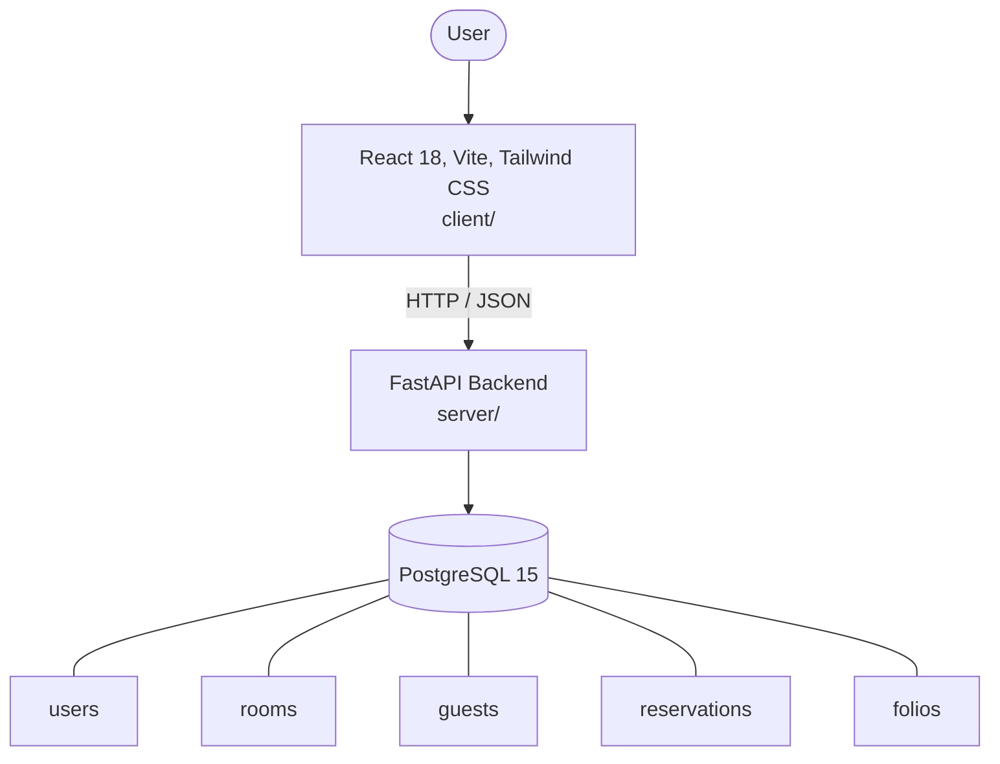

# Architecture

_Auto-generated by the SDLC Assistant from the generated codebase and the approved Feature Spec (latest: SCRUM-56). Regenerated on each push._

## System Diagram

## Tech Stack
- **language**: Python 3.11
- **backend_framework**: FastAPI
- **orm**: SQLAlchemy 2.x
- **database**: PostgreSQL 15
- **frontend**: React 18, Vite, Tailwind CSS
- **cloud_provider**: Google Cloud Run
- **constitution_section_4_followed**: True

## Backend Modules (server/)
- server/__init__.py
- server/auth.py
- server/database.py
- server/main.py
- server/models.py
- server/routers/__init__.py
- server/routers/auth.py
- server/routers/dashboard.py
- server/routers/folios.py
- server/routers/guests.py
- server/routers/reservations.py
- server/routers/rooms.py
- server/schemas.py
- server/tests/__init__.py
- server/tests/conftest.py
- server/tests/test_auth.py
- server/tests/test_dashboard.py
- server/tests/test_folios.py
- server/tests/test_reservations.py
- server/tests/test_rooms.py

## Frontend Modules (client/)
- (no client/ files found yet)

## API Endpoints
- POST /api/v1/auth/login
- GET /api/v1/rooms
- POST /api/v1/rooms
- GET /api/v1/reservations/availability
- POST /api/v1/reservations
- POST /api/v1/folios/{reservation_id}/check-in
- POST /api/v1/folios/{reservation_id}/check-out
- GET /api/v1/dashboard/metrics

## Data Model
- users
- rooms
- guests
- reservations
- folios
