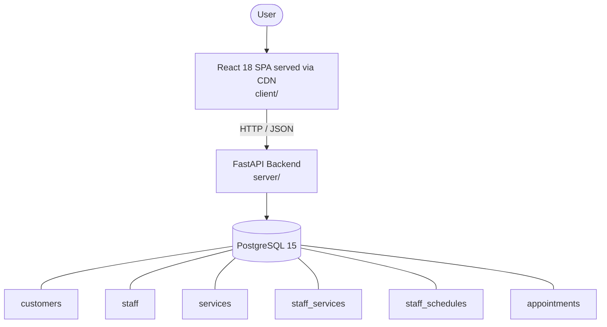

# Architecture

_Auto-generated by the SDLC Assistant from the generated codebase and the approved Feature Spec (latest: SCRUM-264). Regenerated on each push._

## System Diagram

## Tech Stack
- **language**: Python 3.11
- **backend_framework**: FastAPI
- **orm**: SQLAlchemy 2.x
- **database**: PostgreSQL 15
- **frontend**: React 18 SPA served via CDN
- **cloud_provider**: GCP Cloud Run & Cloud SQL
- **constitution_section_4_followed**: True

## Backend Modules (server/)
- server/__init__.py
- server/app/__init__.py
- server/app/api/__init__.py
- server/app/api/v1/__init__.py
- server/app/api/v1/endpoints/__init__.py
- server/app/api/v1/endpoints/appointments.py
- server/app/api/v1/endpoints/customers.py
- server/app/api/v1/endpoints/services.py
- server/app/api/v1/endpoints/staff.py
- server/app/services/__init__.py
- server/app/services/loyalty_service.py
- server/app/services/scheduling_service.py
- server/database.py
- server/main.py
- server/models.py
- server/schemas.py
- server/tests/__init__.py
- server/tests/conftest.py
- server/tests/test_appointments.py
- server/tests/test_customers.py
- server/tests/test_services.py
- server/tests/test_staff.py

## Frontend Modules (client/)
- (no client/ files found yet)

## API Endpoints
- GET /api/v1/appointments/available-slots
- POST /api/v1/appointments
- PATCH /api/v1/appointments/{id}/cancel
- POST /api/v1/staff
- GET /api/v1/staff
- GET /api/v1/customers/{id}
- GET /api/v1/customers/{id}/history

## Data Model
- customers
- staff
- services
- staff_services
- staff_schedules
- appointments
