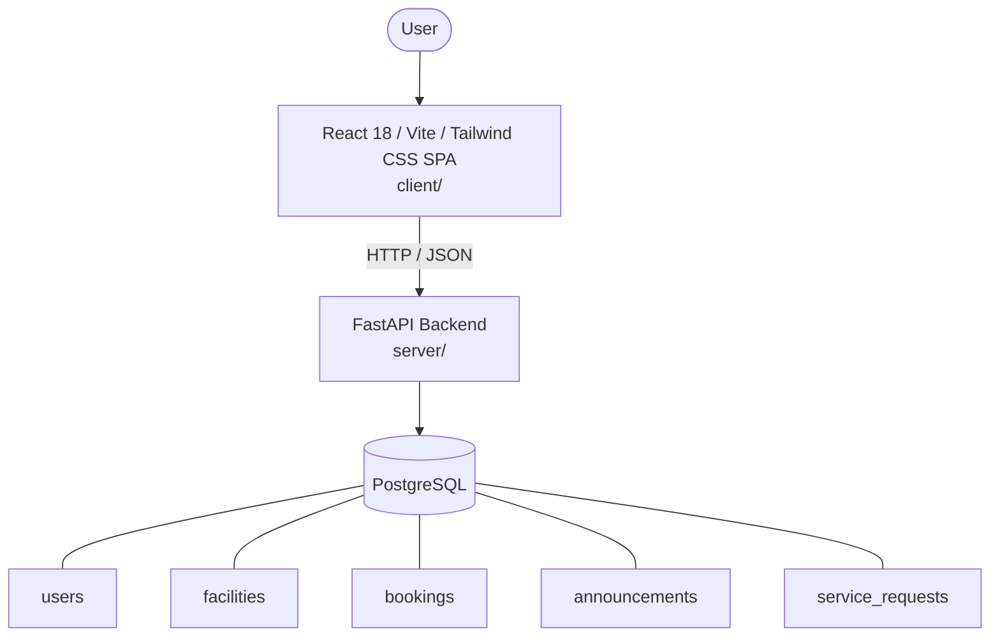

# Architecture

_Auto-generated by the SDLC Assistant from the generated codebase and the approved Feature Spec (latest: SCRUM-233). Regenerated on each push._

## System Diagram

## Tech Stack
- **language**: Python 3.11
- **backend_framework**: FastAPI
- **orm**: SQLAlchemy 2.x
- **database**: PostgreSQL
- **frontend**: React 18 / Vite / Tailwind CSS SPA
- **cloud_provider**: GCP (Cloud Run / Cloud SQL)
- **constitution_section_4_followed**: True

## Backend Modules (server/)
- server/__init__.py
- server/auth.py
- server/config.py
- server/database.py
- server/main.py
- server/models.py
- server/routers/__init__.py
- server/routers/announcements.py
- server/routers/auth.py
- server/routers/bookings.py
- server/routers/facilities.py
- server/routers/residents.py
- server/routers/service_requests.py
- server/schemas.py
- server/tests/__init__.py
- server/tests/conftest.py
- server/tests/test_announcements.py
- server/tests/test_auth.py
- server/tests/test_bookings.py
- server/tests/test_facilities.py
- server/tests/test_service_requests.py

## Frontend Modules (client/)
- (no client/ files found yet)

## API Endpoints
- POST /api/v1/auth/register
- POST /api/v1/auth/login
- GET /api/v1/facilities
- POST /api/v1/bookings
- GET /api/v1/announcements
- POST /api/v1/service-requests

## Data Model
- users
- facilities
- bookings
- announcements
- service_requests
