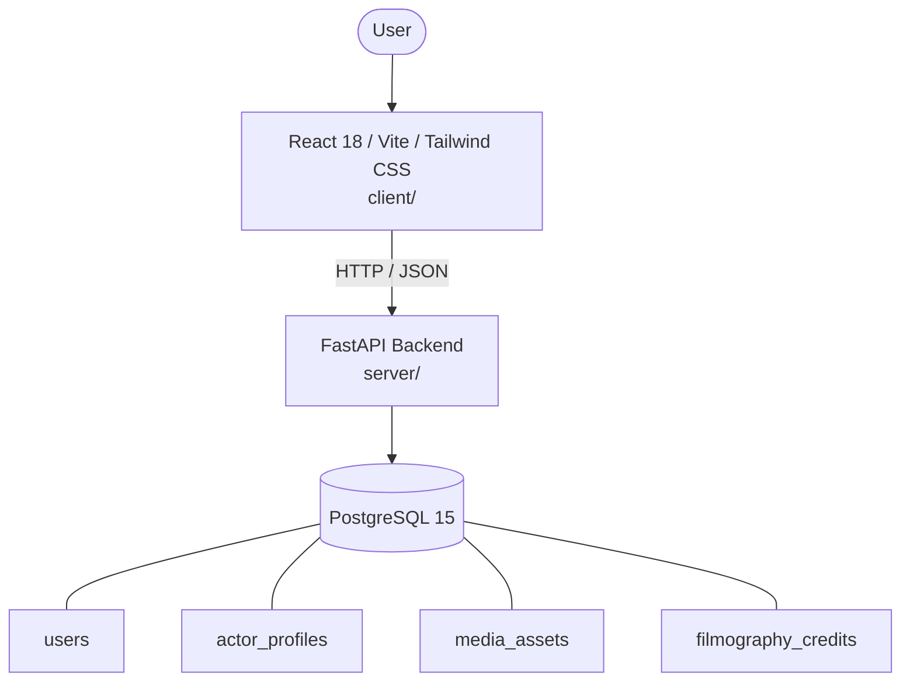

# Architecture

_Auto-generated by the SDLC Assistant from the generated codebase and the approved Feature Spec (latest: SCRUM-243). Regenerated on each push._

## System Diagram

## Tech Stack
- **language**: Python 3.11
- **backend_framework**: FastAPI
- **orm**: SQLAlchemy 2.x
- **database**: PostgreSQL 15
- **frontend**: React 18 / Vite / Tailwind CSS
- **cloud_provider**: Google Cloud Platform
- **constitution_section_4_followed**: True

## Backend Modules (server/)
- server/__init__.py
- server/core/__init__.py
- server/core/security.py
- server/database.py
- server/main.py
- server/models.py
- server/routers/__init__.py
- server/routers/auth.py
- server/routers/credits.py
- server/routers/media.py
- server/routers/profile.py
- server/routers/public.py
- server/schemas.py
- server/tests/__init__.py
- server/tests/conftest.py
- server/tests/test_auth.py
- server/tests/test_credits.py
- server/tests/test_media.py
- server/tests/test_profile.py
- server/tests/test_public.py

## Frontend Modules (client/)
- (no client/ files found yet)

## API Endpoints
- GET /api/v1/actors/profile
- PUT /api/v1/actors/profile
- POST /api/v1/actors/media/upload-url
- POST /api/v1/actors/media
- PUT /api/v1/actors/media/{id}/primary
- DELETE /api/v1/actors/media/{id}
- GET /api/v1/actors/credits
- POST /api/v1/actors/credits
- DELETE /api/v1/actors/credits/{id}
- GET /api/v1/public/actors/{slug}

## Data Model
- users
- actor_profiles
- media_assets
- filmography_credits
