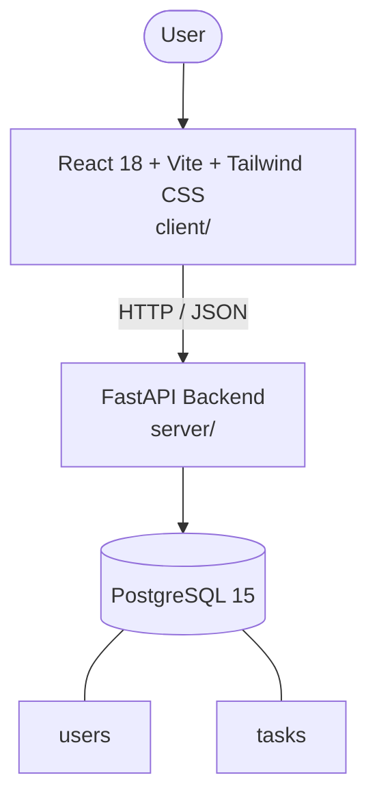

# Architecture

_Auto-generated by the SDLC Assistant from the generated codebase and the approved Feature Spec (latest: SCRUM-68). Regenerated on each push._

## System Diagram

## Tech Stack
- **language**: Python 3.11
- **backend_framework**: FastAPI
- **orm**: SQLAlchemy 2.x
- **database**: PostgreSQL 15
- **frontend**: React 18 + Vite + Tailwind CSS
- **cloud_provider**: Google Cloud Platform (GCP)
- **constitution_section_4_followed**: True

## Backend Modules (server/)
- server/__init__.py
- server/api/__init__.py
- server/api/v1/__init__.py
- server/api/v1/auth.py
- server/api/v1/dashboard.py
- server/api/v1/tasks.py
- server/config.py
- server/conftest.py
- server/database.py
- server/dependencies/__init__.py
- server/dependencies/auth.py
- server/main.py
- server/models/__init__.py
- server/models/task.py
- server/models/user.py
- server/schemas/__init__.py
- server/schemas/auth.py
- server/schemas/dashboard.py
- server/schemas/task.py
- server/security.py
- server/services/__init__.py
- server/services/auth_service.py
- server/services/dashboard_service.py
- server/services/task_service.py
- server/tests/__init__.py
- server/tests/test_auth.py
- server/tests/test_dashboard.py
- server/tests/test_tasks.py

## Frontend Modules (client/)
- (no client/ files found yet)

## API Endpoints
- POST /api/v1/auth/signup
- POST /api/v1/auth/login
- GET /api/v1/tasks
- POST /api/v1/tasks
- GET /api/v1/tasks/{id}
- PUT /api/v1/tasks/{id}
- DELETE /api/v1/tasks/{id}
- GET /api/v1/dashboard/stats

## Data Model
- users
- tasks
