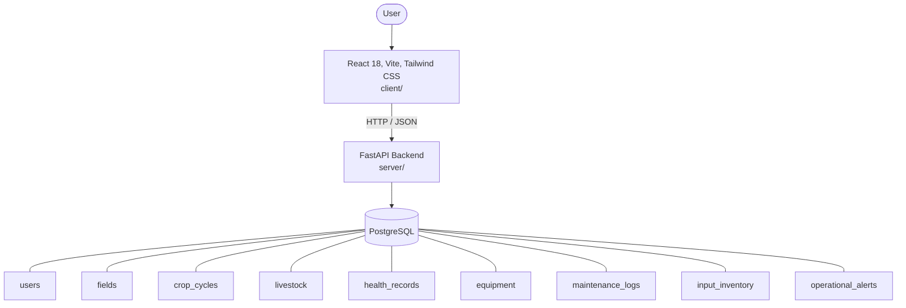

# Architecture

_Auto-generated by the SDLC Assistant from the generated codebase and the approved Feature Spec (latest: SCRUM-259). Regenerated on each push._

## System Diagram

## Tech Stack
- **language**: Python 3.11
- **backend_framework**: FastAPI
- **orm**: SQLAlchemy 2.x
- **database**: PostgreSQL
- **frontend**: React 18, Vite, Tailwind CSS
- **cloud_provider**: Google Cloud Platform (Cloud Run, Cloud SQL)
- **constitution_section_4_followed**: True

## Backend Modules (server/)
- server/__init__.py
- server/auth.py
- server/database.py
- server/main.py
- server/models.py
- server/routers/__init__.py
- server/routers/auth.py
- server/routers/dashboard.py
- server/routers/equipment.py
- server/routers/fields.py
- server/routers/inventory.py
- server/routers/livestock.py
- server/schemas.py
- server/tests/__init__.py
- server/tests/conftest.py
- server/tests/test_auth.py
- server/tests/test_dashboard.py
- server/tests/test_equipment.py
- server/tests/test_fields.py
- server/tests/test_inventory.py
- server/tests/test_livestock.py

## Frontend Modules (client/)
- (no client/ files found yet)

## API Endpoints
- POST /api/v1/auth/login
- GET /api/v1/fields
- POST /api/v1/crop-cycles
- GET /api/v1/livestock
- POST /api/v1/livestock/{id}/health-records
- GET /api/v1/equipment
- POST /api/v1/equipment/{id}/maintenance
- GET /api/v1/inventory
- PATCH /api/v1/inventory/{id}/adjust
- GET /api/v1/dashboard/summary

## Data Model
- users
- fields
- crop_cycles
- livestock
- health_records
- equipment
- maintenance_logs
- input_inventory
- operational_alerts
