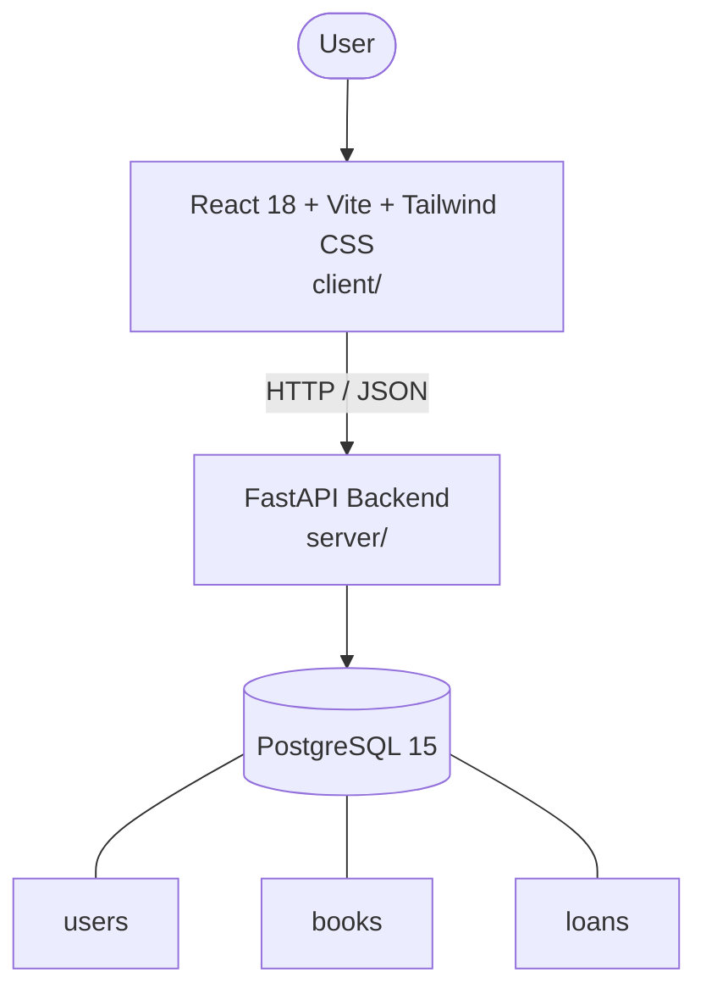

# Architecture

_Auto-generated by the SDLC Assistant from the generated codebase and the approved Feature Spec (latest: SCRUM-237). Regenerated on each push._

## System Diagram

## Tech Stack
- **language**: Python 3.11
- **backend_framework**: FastAPI
- **orm**: SQLAlchemy 2.x
- **database**: PostgreSQL 15
- **frontend**: React 18 + Vite + Tailwind CSS
- **cloud_provider**: GCP
- **constitution_section_4_followed**: True

## Backend Modules (server/)
- server/__init__.py
- server/auth.py
- server/crud.py
- server/database.py
- server/main.py
- server/models.py
- server/routers/__init__.py
- server/routers/auth.py
- server/routers/books.py
- server/routers/loans.py
- server/schemas.py
- server/tests/__init__.py
- server/tests/conftest.py
- server/tests/test_auth.py
- server/tests/test_books.py
- server/tests/test_loans.py

## Frontend Modules (client/)
- client/eslint.config.js
- client/postcss.config.js
- client/src/App.jsx
- client/src/App.test.jsx
- client/src/components/AddBookForm.jsx
- client/src/components/AddBookForm.test.jsx
- client/src/components/AuthCard.jsx
- client/src/components/AuthCard.test.jsx
- client/src/components/BookCard.jsx
- client/src/components/BookCard.test.jsx
- client/src/components/LoansTable.jsx
- client/src/components/LoansTable.test.jsx
- client/src/components/Navbar.jsx
- client/src/components/Navbar.test.jsx
- client/src/components/SearchFilterBar.jsx
- client/src/components/SearchFilterBar.test.jsx
- client/src/context/AuthContext.jsx
- client/src/main.jsx
- client/src/pages/AdminPage.jsx
- client/src/pages/CatalogPage.jsx
- client/src/pages/LoginPage.jsx
- client/src/pages/MyLoansPage.jsx
- client/src/services/api.js
- client/src/services/api.test.js
- client/src/setup.js
- client/tailwind.config.js
- client/vite.config.js

## API Endpoints
- POST /api/v1/auth/register
- POST /api/v1/auth/login
- GET /api/v1/books
- POST /api/v1/books
- GET /api/v1/books/{id}
- POST /api/v1/loans/checkout
- POST /api/v1/loans/return/{loan_id}
- POST /api/v1/loans/renew/{loan_id}
- GET /api/v1/loans/overdue
- GET /api/v1/patrons/{id}/loans

## Data Model
- users
- books
- loans
