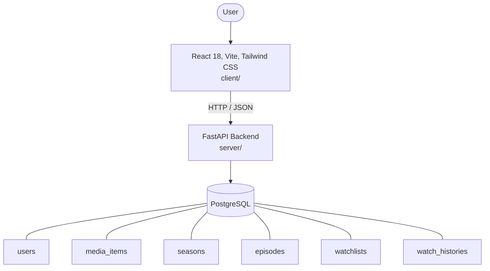

# Architecture

_Auto-generated by the SDLC Assistant from the generated codebase and the approved Feature Spec (latest: SCRUM-217). Regenerated on each push._

## System Diagram

## Tech Stack
- **language**: Python 3.11
- **backend_framework**: FastAPI
- **orm**: SQLAlchemy 2.x
- **database**: PostgreSQL
- **frontend**: React 18, Vite, Tailwind CSS
- **cloud_provider**: Google Cloud Platform (GCP)
- **constitution_section_4_followed**: True

## Backend Modules (server/)
- server/__init__.py
- server/auth.py
- server/config.py
- server/database.py
- server/main.py
- server/models.py
- server/routers/__init__.py
- server/routers/auth.py
- server/routers/history.py
- server/routers/movies.py
- server/routers/search.py
- server/routers/series.py
- server/routers/watchlist.py
- server/schemas.py
- server/tests/__init__.py
- server/tests/conftest.py
- server/tests/test_auth.py
- server/tests/test_history.py
- server/tests/test_movies.py
- server/tests/test_search.py
- server/tests/test_series.py
- server/tests/test_watchlist.py

## Frontend Modules (client/)
- (no client/ files found yet)

## API Endpoints
- POST /api/v1/auth/register
- POST /api/v1/auth/login
- GET /api/v1/movies
- POST /api/v1/movies
- GET /api/v1/movies/{id}
- PUT /api/v1/movies/{id}
- DELETE /api/v1/movies/{id}
- GET /api/v1/series
- POST /api/v1/series
- GET /api/v1/search
- GET /api/v1/watchlist
- POST /api/v1/watchlist
- DELETE /api/v1/watchlist/{media_id}
- GET /api/v1/history
- POST /api/v1/history

## Data Model
- users
- media_items
- seasons
- episodes
- watchlists
- watch_histories
