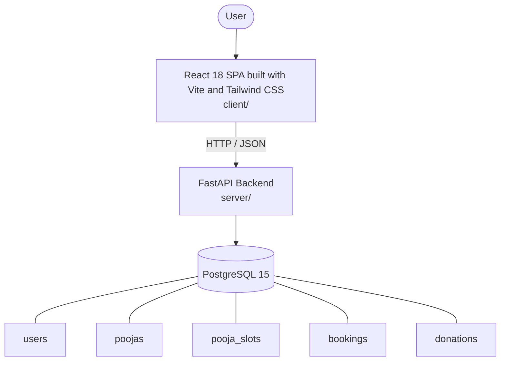

# Architecture

_Auto-generated by the SDLC Assistant from the generated codebase and the approved Feature Spec (latest: SCRUM-145). Regenerated on each push._

## System Diagram

## Tech Stack
- **language**: Python 3.11
- **backend_framework**: FastAPI
- **orm**: SQLAlchemy 2.x
- **database**: PostgreSQL 15
- **frontend**: React 18 SPA built with Vite and Tailwind CSS
- **cloud_provider**: Google Cloud Platform (GCP Cloud Run)
- **constitution_section_4_followed**: True

## Backend Modules (server/)
- server/__init__.py
- server/app/__init__.py
- server/app/database.py
- server/app/main.py
- server/app/models.py
- server/app/routers/__init__.py
- server/app/routers/admin.py
- server/app/routers/auth.py
- server/app/routers/bookings.py
- server/app/routers/donations.py
- server/app/schemas.py
- server/app/utils/__init__.py
- server/app/utils/pdf_generator.py
- server/app/utils/security.py
- server/tests/__init__.py
- server/tests/conftest.py
- server/tests/test_admin.py
- server/tests/test_auth.py
- server/tests/test_bookings.py
- server/tests/test_donations.py

## Frontend Modules (client/)
- (no client/ files found yet)

## API Endpoints
- POST /api/v1/auth/register
- POST /api/v1/auth/login
- GET /api/v1/poojas
- POST /api/v1/bookings
- GET /api/v1/bookings/my-bookings
- POST /api/v1/donations
- GET /api/v1/donations/{id}/receipt
- GET /api/v1/admin/dashboard
- GET /api/v1/admin/financial-report

## Data Model
- users
- poojas
- pooja_slots
- bookings
- donations
