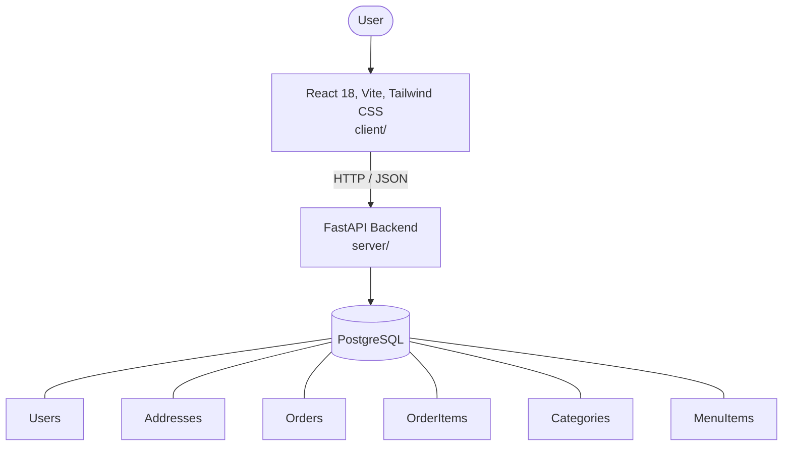

# Architecture

_Auto-generated by the SDLC Assistant from the generated codebase and the approved Feature Spec (latest: SCRUM-66). Regenerated on each push._

## System Diagram

## Tech Stack
- **language**: Python 3.11
- **backend_framework**: FastAPI
- **orm**: SQLAlchemy 2.x
- **database**: PostgreSQL
- **frontend**: React 18, Vite, Tailwind CSS
- **cloud_provider**: Google Cloud Platform (GCP Cloud Run)
- **constitution_section_4_followed**: True

## Backend Modules (server/)
- server/__init__.py
- server/auth.py
- server/conftest.py
- server/database.py
- server/main.py
- server/models.py
- server/routers/__init__.py
- server/routers/auth.py
- server/routers/menu.py
- server/routers/orders.py
- server/schemas.py
- server/tests/__init__.py
- server/tests/test_auth.py
- server/tests/test_menu.py
- server/tests/test_orders.py

## Frontend Modules (client/)
- client/eslint.config.js
- client/postcss.config.js
- client/src/App.jsx
- client/src/components/Navbar.test.jsx
- client/src/components/cart/CartDrawer.jsx
- client/src/components/checkout/AddressForm.jsx
- client/src/components/layout/Navbar.jsx
- client/src/components/menu/MenuItemCard.jsx
- client/src/components/profile/ProfileHeader.jsx
- client/src/components/staff/ActiveOrdersTable.jsx
- client/src/components/staff/MenuAvailabilityControl.jsx
- client/src/components/tracking/OrderLifecycleTimeline.jsx
- client/src/main.jsx
- client/src/pages/CheckoutPage.jsx
- client/src/pages/DigitalMenuCartPage.jsx
- client/src/pages/DigitalMenuCartPage.test.jsx
- client/src/pages/LoginPage.jsx
- client/src/pages/OrderTrackingPage.jsx
- client/src/pages/ProfilePage.jsx
- client/src/pages/RegisterPage.jsx
- client/src/pages/StaffDashboardPage.jsx
- client/src/services/api.js
- client/src/services/api.test.js
- client/src/setup.js
- client/tailwind.config.js
- client/vite.config.js

## API Endpoints
- POST /api/v1/auth/register
- POST /api/v1/auth/login
- GET /api/v1/auth/me
- GET /api/v1/menu/categories
- GET /api/v1/menu/items
- POST /api/v1/menu/items
- PUT /api/v1/menu/items/{id}
- POST /api/v1/orders
- GET /api/v1/orders/my-orders
- GET /api/v1/orders/{id}
- GET /api/v1/orders/staff/dashboard
- PATCH /api/v1/orders/{id}/status

## Data Model
- Users
- Addresses
- Orders
- OrderItems
- Categories
- MenuItems
