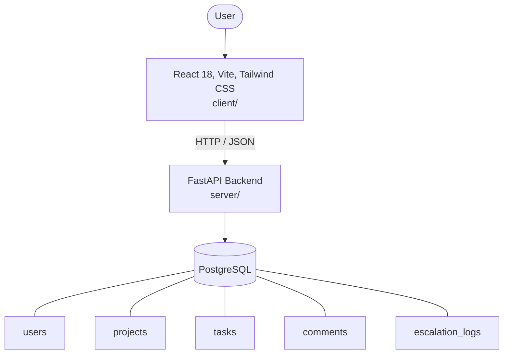

# Architecture

_Auto-generated by the SDLC Assistant from the generated codebase and the approved Feature Spec (latest: SCRUM-192). Regenerated on each push._

## System Diagram

## Tech Stack
- **language**: Python 3.11
- **backend_framework**: FastAPI
- **orm**: SQLAlchemy 2.x
- **database**: PostgreSQL
- **frontend**: React 18, Vite, Tailwind CSS
- **cloud_provider**: GCP (Cloud Run)
- **constitution_section_4_followed**: True

## Backend Modules (server/)
- server/__init__.py
- server/api/__init__.py
- server/api/v1/__init__.py
- server/api/v1/analytics.py
- server/api/v1/auth.py
- server/api/v1/comments.py
- server/api/v1/escalations.py
- server/api/v1/projects.py
- server/api/v1/tasks.py
- server/core/__init__.py
- server/core/config.py
- server/core/security.py
- server/db/__init__.py
- server/db/session.py
- server/main.py
- server/models/__init__.py
- server/models/comment.py
- server/models/escalation.py
- server/models/project.py
- server/models/task.py
- server/models/user.py
- server/schemas/__init__.py
- server/schemas/analytics.py
- server/schemas/comment.py
- server/schemas/escalation.py
- server/schemas/project.py
- server/schemas/task.py
- server/schemas/user.py
- server/services/__init__.py
- server/services/analytics.py
- server/services/escalation.py
- server/tests/__init__.py
- server/tests/conftest.py
- server/tests/test_analytics.py
- server/tests/test_auth.py
- server/tests/test_bulk_update.py
- server/tests/test_comments.py
- server/tests/test_escalations.py
- server/tests/test_projects.py
- server/tests/test_tasks.py

## Frontend Modules (client/)
- client/eslint.config.js
- client/postcss.config.js
- client/src/App.jsx
- client/src/components/common/Badge.jsx
- client/src/components/common/Badge.test.jsx
- client/src/components/common/Modal.jsx
- client/src/components/common/Modal.test.jsx
- client/src/components/layout/Navbar.jsx
- client/src/components/layout/Navbar.test.jsx
- client/src/components/layout/Sidebar.jsx
- client/src/components/projects/ProjectCard.jsx
- client/src/components/projects/ProjectCard.test.jsx
- client/src/components/projects/ProjectFormModal.jsx
- client/src/components/tasks/CommentThread.jsx
- client/src/components/tasks/TaskCard.jsx
- client/src/components/tasks/TaskCard.test.jsx
- client/src/components/tasks/TaskFormModal.jsx
- client/src/context/AuthContext.jsx
- client/src/main.jsx
- client/src/pages/LoginPage.jsx
- client/src/pages/LoginPage.test.jsx
- client/src/pages/ProjectDetailPage.jsx
- client/src/pages/ProjectsPage.jsx
- client/src/pages/TaskDetailPage.jsx
- client/src/services/api.js
- client/src/services/api.test.js
- client/src/setup.js
- client/tailwind.config.js
- client/vite.config.js

## API Endpoints
- POST /api/v1/auth/login
- GET /api/v1/projects
- GET /api/v1/tasks
- PATCH /api/v1/tasks/bulk-update
- GET /api/v1/analytics/tasks
- GET /api/v1/analytics/productivity

## Data Model
- users
- projects
- tasks
- comments
- escalation_logs
