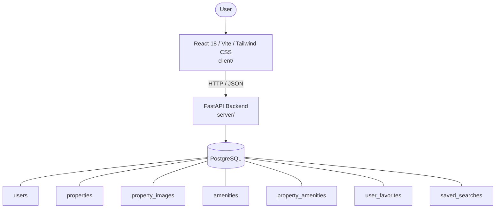

# Architecture

_Auto-generated by the SDLC Assistant from the generated codebase and the approved Feature Spec (latest: SCRUM-208). Regenerated on each push._

## System Diagram

## Tech Stack
- **language**: Python 3.11
- **backend_framework**: FastAPI
- **orm**: SQLAlchemy 2.x
- **database**: PostgreSQL
- **frontend**: React 18 / Vite / Tailwind CSS
- **cloud_provider**: Google Cloud Platform (Cloud Run, Cloud SQL, GCS)
- **constitution_section_4_followed**: True

## Backend Modules (server/)
- server/__init__.py
- server/app/__init__.py
- server/app/auth/__init__.py
- server/app/auth/router.py
- server/app/auth/utils.py
- server/app/config.py
- server/app/database.py
- server/app/favorites/__init__.py
- server/app/favorites/router.py
- server/app/models.py
- server/app/properties/__init__.py
- server/app/properties/crud.py
- server/app/properties/router.py
- server/app/properties/search.py
- server/app/saved_searches/__init__.py
- server/app/saved_searches/router.py
- server/app/schemas.py
- server/main.py
- server/tests/__init__.py
- server/tests/conftest.py
- server/tests/test_auth.py
- server/tests/test_favorites.py
- server/tests/test_properties.py
- server/tests/test_saved_searches.py

## Frontend Modules (client/)
- (no client/ files found yet)

## API Endpoints
- POST /api/v1/auth/register
- POST /api/v1/auth/login
- GET /api/v1/properties
- GET /api/v1/properties/{id}
- POST /api/v1/properties
- PUT /api/v1/properties/{id}
- DELETE /api/v1/properties/{id}
- POST /api/v1/properties/{id}/images
- GET /api/v1/favorites
- POST /api/v1/favorites/{property_id}
- DELETE /api/v1/favorites/{property_id}
- GET /api/v1/saved-searches
- POST /api/v1/saved-searches

## Data Model
- users
- properties
- property_images
- amenities
- property_amenities
- user_favorites
- saved_searches
