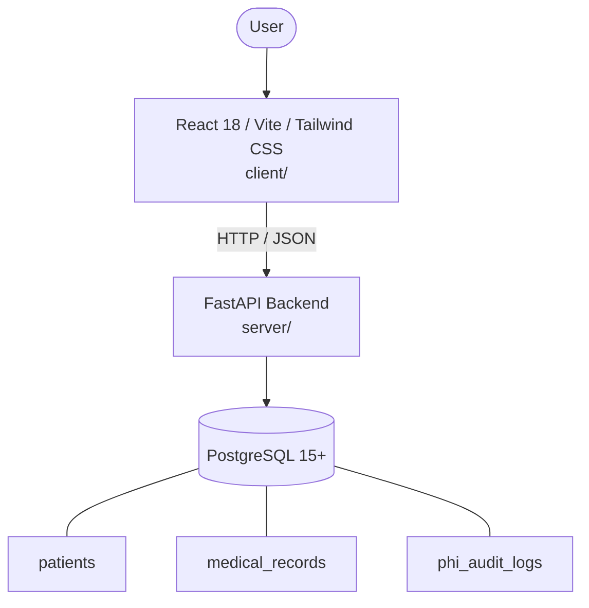

# Architecture

_Auto-generated by the SDLC Assistant from the generated codebase and the approved Feature Spec (latest: SCRUM-201). Regenerated on each push._

## System Diagram

## Tech Stack
- **language**: Python 3.11
- **backend_framework**: FastAPI
- **orm**: SQLAlchemy 2.x
- **database**: PostgreSQL 15+
- **frontend**: React 18 / Vite / Tailwind CSS
- **cloud_provider**: GCP (Cloud Run, Cloud SQL)
- **constitution_section_4_followed**: True

## Backend Modules (server/)
- server/__init__.py
- server/api/__init__.py
- server/api/auth.py
- server/api/patients.py
- server/config.py
- server/core/__init__.py
- server/core/auth.py
- server/database.py
- server/main.py
- server/models.py
- server/schemas.py
- server/services/__init__.py
- server/services/audit_service.py
- server/services/medical_record_service.py
- server/services/patient_service.py
- server/services/search_service.py
- server/tests/__init__.py
- server/tests/conftest.py
- server/tests/test_auth.py
- server/tests/test_patients.py

## Frontend Modules (client/)
- (no client/ files found yet)

## API Endpoints
- POST /api/v1/patients
- GET /api/v1/patients/search
- GET /api/v1/patients/{id}
- PUT /api/v1/patients/{id}/medical-history

## Data Model
- patients
- medical_records
- phi_audit_logs
