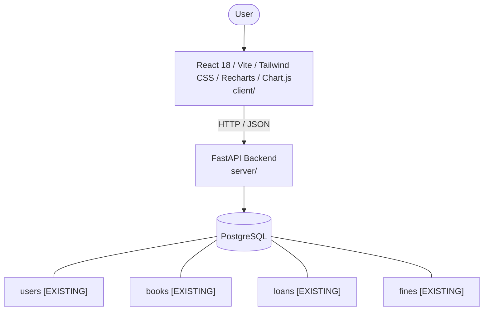

# Architecture

_Auto-generated by the SDLC Assistant from the generated codebase and the approved Feature Spec (latest: SCRUM-51). Regenerated on each push._

## System Diagram

## Tech Stack
- **language**: Python 3.11
- **backend_framework**: FastAPI
- **orm**: SQLAlchemy 2.x
- **database**: PostgreSQL
- **frontend**: React 18 / Vite / Tailwind CSS / Recharts / Chart.js
- **cloud_provider**: GCP Cloud Run
- **constitution_section_4_followed**: True

## Backend Modules (server/)
- server/__init__.py
- server/database.py
- server/dependencies.py
- server/main.py
- server/models.py
- server/routers/__init__.py
- server/routers/admin.py
- server/routers/auth.py
- server/routers/books.py
- server/routers/loans.py
- server/routers/users.py
- server/schemas.py
- server/security.py
- server/tests/__init__.py
- server/tests/conftest.py
- server/tests/test_admin.py
- server/tests/test_auth.py
- server/tests/test_books.py
- server/tests/test_loans.py

## Frontend Modules (client/)
- client/eslint.config.js
- client/postcss.config.js
- client/src/App.jsx
- client/src/App.test.jsx
- client/src/components/admin/BookFormCard.jsx
- client/src/components/admin/InventoryTable.jsx
- client/src/components/catalog/BookCard.jsx
- client/src/components/common/Badge.jsx
- client/src/components/common/Button.jsx
- client/src/components/common/SearchBar.jsx
- client/src/components/common/StatCard.jsx
- client/src/components/layout/Navbar.jsx
- client/src/components/loans/LoansTable.jsx
- client/src/context/AuthContext.jsx
- client/src/main.jsx
- client/src/pages/AdminInventoryPage.jsx
- client/src/pages/CatalogPage.jsx
- client/src/pages/LoginPage.jsx
- client/src/pages/MyLoansPage.jsx
- client/src/pages/RegisterPage.jsx
- client/src/services/api.js
- client/src/setup.js
- client/tailwind.config.js
- client/vite.config.js

## API Endpoints
- POST /api/v1/auth/register
- POST /api/v1/auth/login
- GET /api/v1/auth/me
- GET /api/v1/books
- POST /api/v1/books
- GET /api/v1/books/{id}
- PUT /api/v1/books/{id}
- DELETE /api/v1/books/{id}
- POST /api/v1/loans/checkout
- POST /api/v1/loans/return/{id}
- POST /api/v1/loans/renew/{id}
- GET /api/v1/loans/my-loans
- GET /api/v1/admin/analytics

## Data Model
- users [EXISTING]
- books [EXISTING]
- loans [EXISTING]
- fines [EXISTING]
