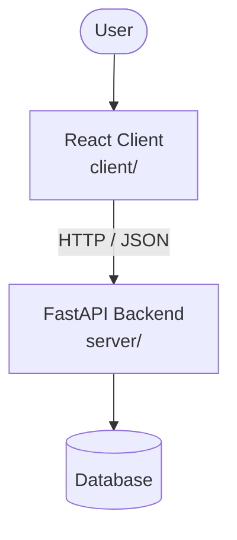

# Architecture

_Auto-generated by the SDLC Assistant from the generated codebase and the approved Feature Spec (latest: SCRUM-45). Regenerated on each push._

## System Diagram

## Tech Stack
- Not specified

## Backend Modules (server/)
- server/__init__.py
- server/api/__init__.py
- server/api/v1/__init__.py
- server/api/v1/auth.py
- server/api/v1/tasks.py
- server/auth.py
- server/database.py
- server/main.py
- server/models.py
- server/schemas.py
- server/services/__init__.py
- server/services/task_engine.py
- server/tests/__init__.py
- server/tests/conftest.py
- server/tests/test_auth.py
- server/tests/test_tasks.py

## Frontend Modules (client/)
- (no client/ files found yet)

## API Endpoints
- None

## Data Model
- None
