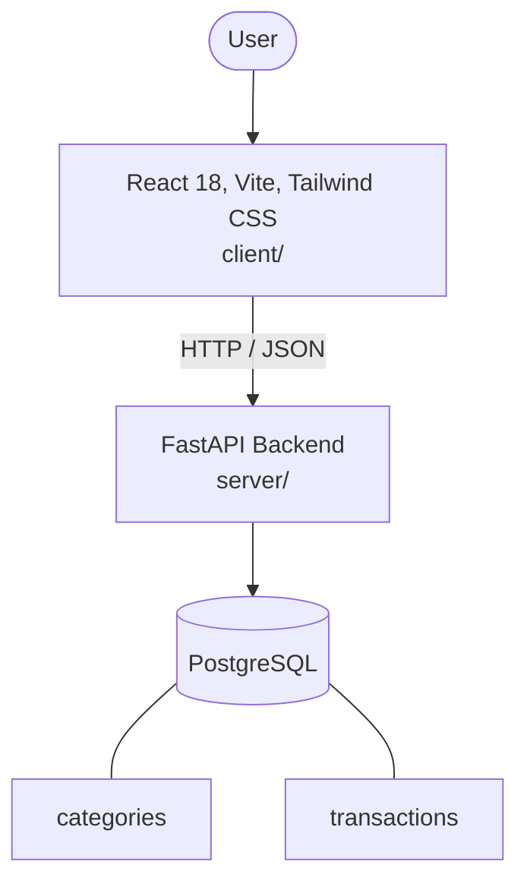

# Architecture

_Auto-generated by the SDLC Assistant from the generated codebase and the approved Feature Spec (latest: SCRUM-159). Regenerated on each push._

## System Diagram

## Tech Stack
- **language**: Python 3.11
- **backend_framework**: FastAPI
- **orm**: SQLAlchemy 2.x
- **database**: PostgreSQL
- **frontend**: React 18, Vite, Tailwind CSS
- **cloud_provider**: GCP Cloud Run
- **constitution_section_4_followed**: True

## Backend Modules (server/)
- server/__init__.py
- server/database.py
- server/main.py
- server/models.py
- server/routers/__init__.py
- server/routers/categories.py
- server/routers/expenses.py
- server/routers/summary.py
- server/schemas.py
- server/tests/__init__.py
- server/tests/conftest.py
- server/tests/test_categories.py
- server/tests/test_expenses.py
- server/tests/test_summary.py

## Frontend Modules (client/)
- client/eslint.config.js
- client/postcss.config.js
- client/src/App.jsx
- client/src/components/categories/AddCategoryForm.jsx
- client/src/components/categories/CategoryDirectoryTable.jsx
- client/src/components/dashboard/MetricGroup.jsx
- client/src/components/dashboard/RecentTransactionsCard.jsx
- client/src/components/dashboard/SpendingBreakdownCard.jsx
- client/src/components/layout/Navbar.jsx
- client/src/components/transactions/FilterBar.jsx
- client/src/components/transactions/TransactionsTable.jsx
- client/src/main.jsx
- client/src/pages/CategoriesPage.jsx
- client/src/pages/DashboardPage.jsx
- client/src/pages/TransactionsPage.jsx
- client/src/services/api.js
- client/src/setup.js
- client/src/tests/DashboardPage.test.jsx
- client/tailwind.config.js
- client/vite.config.js

## API Endpoints
- GET /api/v1/expenses
- POST /api/v1/expenses
- GET /api/v1/expenses/{id}
- PUT /api/v1/expenses/{id}
- DELETE /api/v1/expenses/{id}
- GET /api/v1/categories
- POST /api/v1/categories
- GET /api/v1/summary

## Data Model
- categories
- transactions
