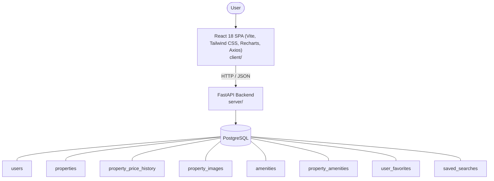

# Architecture

_Auto-generated by the SDLC Assistant from the generated codebase and the approved Feature Spec (latest: SCRUM-208). Regenerated on each push._

## System Diagram

## Tech Stack
- **language**: Python 3.11
- **backend_framework**: FastAPI
- **orm**: SQLAlchemy 2.x
- **database**: PostgreSQL
- **frontend**: React 18 SPA (Vite, Tailwind CSS, Recharts, Axios)
- **cloud_provider**: Google Cloud Platform (GCP Cloud Run, Cloud SQL)
- **constitution_section_4_followed**: True

## Backend Modules (server/)
- server/__init__.py
- server/alembic/__init__.py
- server/alembic/versions/__init__.py
- server/alembic/versions/add_property_price_history_table.py
- server/app/__init__.py
- server/app/api/__init__.py
- server/app/api/v1/__init__.py
- server/app/api/v1/endpoints/__init__.py
- server/app/api/v1/endpoints/analytics.py
- server/app/api/v1/endpoints/properties.py
- server/app/config.py
- server/app/crud/__init__.py
- server/app/crud/crud_price_history.py
- server/app/database.py
- server/app/models.py
- server/app/schemas.py
- server/main.py
- server/tests/__init__.py
- server/tests/conftest.py
- server/tests/test_analytics.py
- server/tests/test_price_history.py

## Frontend Modules (client/)
- client/eslint.config.js
- client/postcss.config.js
- client/src/App.jsx
- client/src/components/AgentContactCard.jsx
- client/src/components/FilterSidebar.jsx
- client/src/components/ListingModal.jsx
- client/src/components/Navbar.jsx
- client/src/components/Navbar.test.jsx
- client/src/components/PropertyCard.jsx
- client/src/components/PropertyCard.test.jsx
- client/src/components/SearchHeader.jsx
- client/src/main.jsx
- client/src/pages/FavoritesPage.jsx
- client/src/pages/ListingManagementPage.jsx
- client/src/pages/PropertyDetailPage.jsx
- client/src/pages/SearchDashboardPage.jsx
- client/src/pages/SearchDashboardPage.test.jsx
- client/src/services/api.js
- client/src/setup.js
- client/tailwind.config.js
- client/vite.config.js

## API Endpoints
- GET /api/v1/analytics/cma
- GET /api/v1/properties/{id}/price-history
- PUT /api/v1/properties/{id}
- GET /api/v1/properties
- GET /api/v1/properties/{id}

## Data Model
- users
- properties
- property_price_history
- property_images
- amenities
- property_amenities
- user_favorites
- saved_searches
