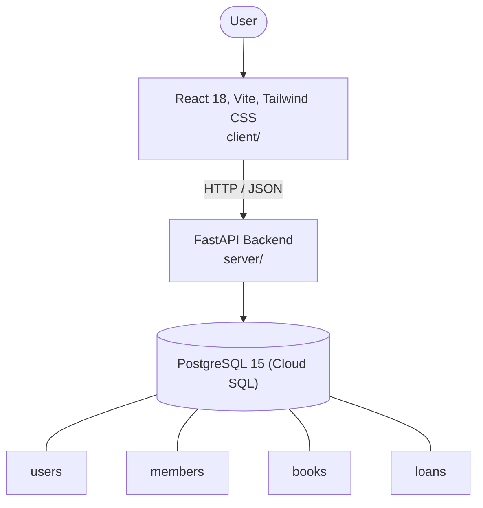

# Architecture

_Auto-generated by the SDLC Assistant from the generated codebase and the approved Feature Spec (latest: SCRUM-269). Regenerated on each push._

## System Diagram

## Tech Stack
- **language**: Python 3.11
- **backend_framework**: FastAPI
- **orm**: SQLAlchemy 2.x
- **database**: PostgreSQL 15 (Cloud SQL)
- **frontend**: React 18, Vite, Tailwind CSS
- **cloud_provider**: Google Cloud Platform (Cloud Run)
- **constitution_section_4_followed**: True

## Backend Modules (server/)
- server/__init__.py
- server/database.py
- server/main.py
- server/models.py
- server/routers/__init__.py
- server/routers/auth.py
- server/routers/books.py
- server/routers/fines.py
- server/routers/loans.py
- server/routers/members.py
- server/schemas.py
- server/services/__init__.py
- server/services/fine_calculator.py
- server/tests/__init__.py
- server/tests/conftest.py
- server/tests/test_auth.py
- server/tests/test_books.py
- server/tests/test_fines.py
- server/tests/test_loans.py
- server/tests/test_members.py

## Frontend Modules (client/)
- (no client/ files found yet)

## API Endpoints
- POST /api/v1/auth/login
- GET /api/v1/books
- GET /api/v1/books/{id}
- POST /api/v1/books
- PUT /api/v1/books/{id}
- DELETE /api/v1/books/{id}
- POST /api/v1/members
- GET /api/v1/members/{id}
- POST /api/v1/loans/checkout
- POST /api/v1/loans/{id}/return
- POST /api/v1/loans/{id}/renew
- GET /api/v1/loans/my-loans
- POST /api/v1/fines/{id}/pay

## Data Model
- users
- members
- books
- loans
