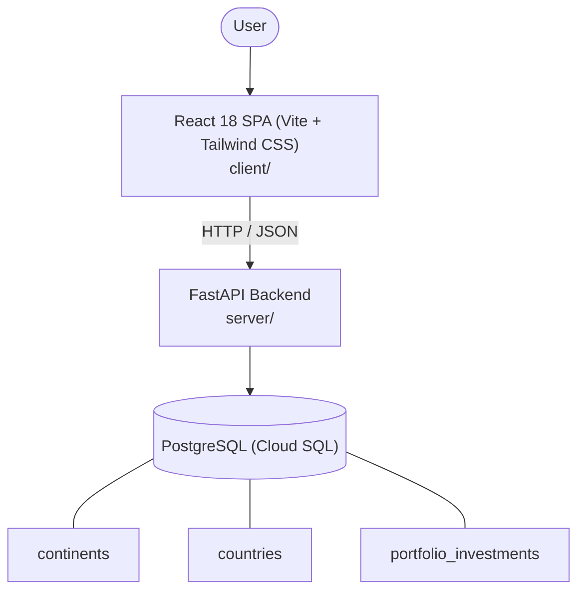

# Architecture

_Auto-generated by the SDLC Assistant from the generated codebase and the approved Feature Spec (latest: SCRUM-114). Regenerated on each push._

## System Diagram

## Tech Stack
- **language**: Python 3.11
- **backend_framework**: FastAPI
- **orm**: SQLAlchemy 2.x
- **database**: PostgreSQL (Cloud SQL)
- **frontend**: React 18 SPA (Vite + Tailwind CSS)
- **cloud_provider**: Google Cloud Platform (GCP)
- **constitution_section_4_followed**: True

## Backend Modules (server/)
- server/__init__.py
- server/database.py
- server/main.py
- server/models.py
- server/routers/__init__.py
- server/routers/continents.py
- server/routers/countries.py
- server/schemas.py
- server/tests/__init__.py
- server/tests/conftest.py
- server/tests/test_continents.py
- server/tests/test_countries.py

## Frontend Modules (client/)
- (no client/ files found yet)

## API Endpoints
- GET /api/v1/continents
- GET /api/v1/countries
- GET /api/v1/countries/{country_id}

## Data Model
- continents
- countries
- portfolio_investments
