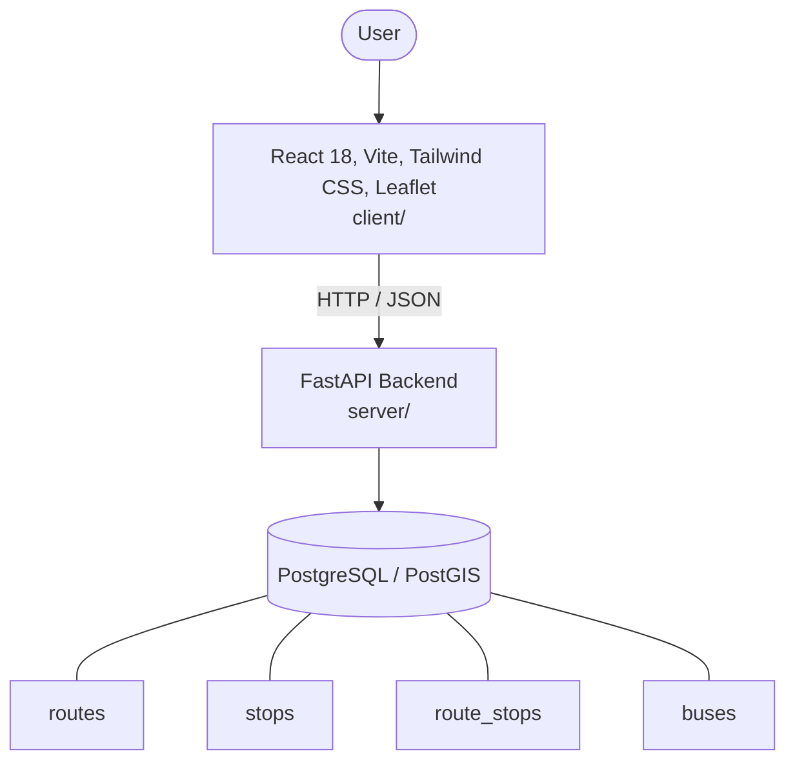

# Architecture

_Auto-generated by the SDLC Assistant from the generated codebase and the approved Feature Spec (latest: SCRUM-42). Regenerated on each push._

## System Diagram

## Tech Stack
- **language**: Python 3.11
- **backend_framework**: FastAPI
- **orm**: SQLAlchemy 2.x
- **database**: PostgreSQL / PostGIS
- **frontend**: React 18, Vite, Tailwind CSS, Leaflet
- **cloud_provider**: Google Cloud Platform (GCP Cloud Run, Cloud SQL)
- **constitution_section_4_followed**: True

## Backend Modules (server/)
- server/__init__.py
- server/app/__init__.py
- server/app/config.py
- server/app/database.py
- server/app/main.py
- server/app/models/__init__.py
- server/app/models/bus_tracking.py
- server/app/models/communication.py
- server/app/models/facility.py
- server/app/models/maintenance.py
- server/app/models/payment.py
- server/app/models/resident.py
- server/app/models/visitor.py
- server/app/routers/__init__.py
- server/app/routers/bus_tracking.py
- server/app/routers/communication.py
- server/app/routers/facility.py
- server/app/routers/maintenance.py
- server/app/routers/payment.py
- server/app/routers/resident.py
- server/app/routers/visitor.py
- server/app/schemas/__init__.py
- server/app/schemas/bus_tracking.py
- server/app/schemas/communication.py
- server/app/schemas/facility.py
- server/app/schemas/maintenance.py
- server/app/schemas/payment.py
- server/app/schemas/resident.py
- server/app/schemas/visitor.py
- server/app/seed_data.py
- server/main.py
- server/tests/__init__.py
- server/tests/conftest.py
- server/tests/test_bus_tracking.py
- server/tests/test_communication.py
- server/tests/test_facility.py
- server/tests/test_maintenance.py
- server/tests/test_payment.py
- server/tests/test_resident.py
- server/tests/test_visitor.py

## Frontend Modules (client/)
- client/eslint.config.js
- client/postcss.config.js
- client/src/App.jsx
- client/src/App.test.jsx
- client/src/components/common/Badge.jsx
- client/src/components/common/Button.jsx
- client/src/components/common/Modal.jsx
- client/src/components/common/SearchBar.jsx
- client/src/components/dashboard/AnnouncementsFeed.jsx
- client/src/components/dashboard/StatGrid.jsx
- client/src/components/dashboard/VisitorLog.jsx
- client/src/components/facilities/AvailableFacilitiesList.jsx
- client/src/components/facilities/BookingCalendar.jsx
- client/src/components/layout/AppLayout.jsx
- client/src/components/layout/Header.jsx
- client/src/components/layout/Sidebar.jsx
- client/src/components/maintenance/RequestHistoryList.jsx
- client/src/components/maintenance/SubmitRequestForm.jsx
- client/src/components/payments/OutstandingBillsTable.jsx
- client/src/components/payments/PaymentGatewayPanel.jsx
- client/src/components/payments/PaymentHistoryTable.jsx
- client/src/components/profile/FamilyMembersList.jsx
- client/src/components/profile/PersonalDetailsForm.jsx
- client/src/main.jsx
- client/src/pages/DashboardPage.jsx
- client/src/pages/FacilitiesPage.jsx
- client/src/pages/MaintenancePage.jsx
- client/src/pages/PaymentsPage.jsx
- client/src/pages/ProfilePage.jsx
- client/src/services/api.js
- client/src/setup.js
- client/tailwind.config.js
- client/vite.config.js

## API Endpoints
- GET /api/v1/routes
- GET /api/v1/routes/{route_id}
- POST /api/v1/routes
- DELETE /api/v1/routes/{route_id}
- GET /api/v1/stops/search
- GET /api/v1/stops/{stop_id}/eta
- GET /api/v1/buses
- POST /api/v1/buses/telemetry
- POST /api/v1/alerts

## Data Model
- routes
- stops
- route_stops
- buses
