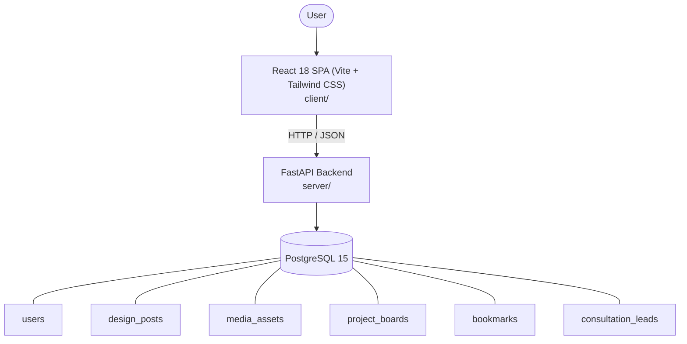

# Architecture

_Auto-generated by the SDLC Assistant from the generated codebase and the approved Feature Spec (latest: SCRUM-207). Regenerated on each push._

## System Diagram

## Tech Stack
- **language**: Python 3.11
- **backend_framework**: FastAPI
- **orm**: SQLAlchemy 2.x
- **database**: PostgreSQL 15
- **frontend**: React 18 SPA (Vite + Tailwind CSS)
- **cloud_provider**: Google Cloud Platform
- **constitution_section_4_followed**: True

## Backend Modules (server/)
- server/__init__.py
- server/auth.py
- server/config.py
- server/database.py
- server/main.py
- server/models.py
- server/routers/__init__.py
- server/routers/auth.py
- server/routers/boards.py
- server/routers/designs.py
- server/routers/leads.py
- server/routers/media.py
- server/schemas.py
- server/tests/__init__.py
- server/tests/conftest.py
- server/tests/test_auth.py
- server/tests/test_boards.py
- server/tests/test_designs.py
- server/tests/test_leads.py
- server/tests/test_media.py

## Frontend Modules (client/)
- (no client/ files found yet)

## API Endpoints
- POST /api/v1/auth/register
- POST /api/v1/auth/login
- GET /api/v1/auth/me
- GET /api/v1/designs
- GET /api/v1/designs/{id}
- POST /api/v1/designs
- POST /api/v1/media/presigned-url
- POST /api/v1/media/confirm
- GET /api/v1/boards
- POST /api/v1/boards
- POST /api/v1/boards/{id}/bookmarks
- POST /api/v1/leads
- GET /api/v1/leads

## Data Model
- users
- design_posts
- media_assets
- project_boards
- bookmarks
- consultation_leads
