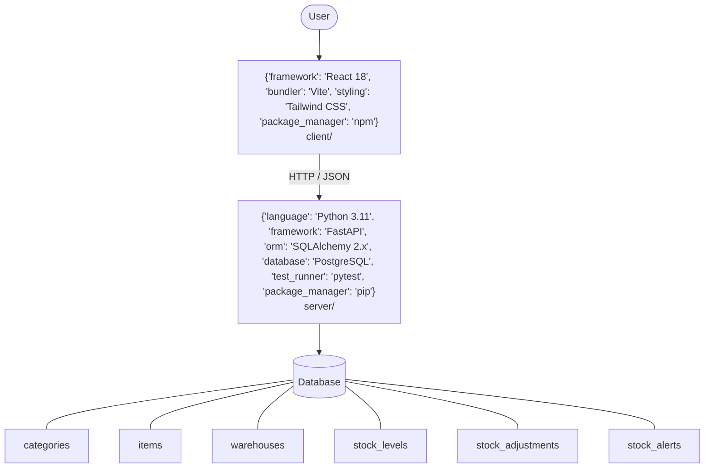

# Architecture

_Auto-generated by the SDLC Assistant from the generated codebase and the approved Feature Spec (latest: SCRUM-2). Regenerated on each push._

## System Diagram


## Tech Stack
```json
{
  "backend": {
    "language": "Python 3.11",
    "framework": "FastAPI",
    "orm": "SQLAlchemy 2.x",
    "database": "PostgreSQL",
    "test_runner": "pytest",
    "package_manager": "pip"
  },
  "frontend": {
    "framework": "React 18",
    "bundler": "Vite",
    "styling": "Tailwind CSS",
    "package_manager": "npm"
  }
}
```

## Backend Modules (server/)
- server/__init__.py
- server/crud.py
- server/database.py
- server/main.py
- server/models.py
- server/routers/__init__.py
- server/routers/adjustments.py
- server/routers/alerts.py
- server/routers/categories.py
- server/routers/inventory.py
- server/routers/items.py
- server/routers/warehouses.py
- server/schemas.py
- server/tests/__init__.py
- server/tests/conftest.py
- server/tests/test_adjustments.py
- server/tests/test_alerts.py
- server/tests/test_inventory.py
- server/tests/test_items.py

## Frontend Modules (client/)
- (no client/ files found yet)

## API Endpoints
- POST /api/v1/items
- GET /api/v1/items
- GET /api/v1/inventory
- POST /api/v1/stock-adjustments
- GET /api/v1/alerts

## Data Model
- categories
- items
- warehouses
- stock_levels
- stock_adjustments
- stock_alerts
