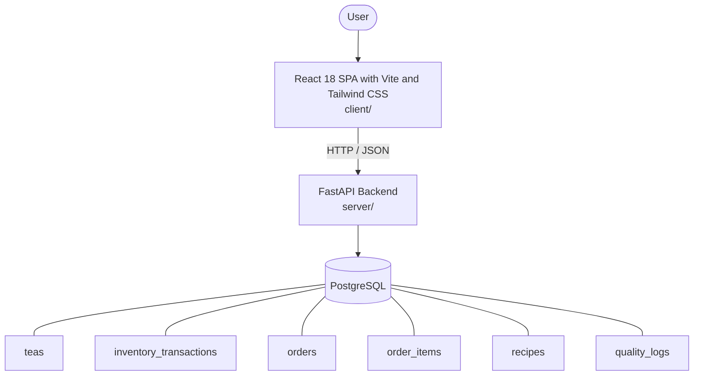

# Architecture

_Auto-generated by the SDLC Assistant from the generated codebase and the approved Feature Spec (latest: SCRUM-251). Regenerated on each push._

## System Diagram

## Tech Stack
- **language**: Python 3.11
- **backend_framework**: FastAPI
- **orm**: SQLAlchemy 2.x
- **database**: PostgreSQL
- **frontend**: React 18 SPA with Vite and Tailwind CSS
- **cloud_provider**: Google Cloud Platform (Cloud Run, Cloud SQL)
- **constitution_section_4_followed**: True

## Backend Modules (server/)
- server/__init__.py
- server/crud.py
- server/database.py
- server/main.py
- server/models.py
- server/routers/__init__.py
- server/routers/inventory.py
- server/routers/orders.py
- server/routers/quality_logs.py
- server/routers/recipes.py
- server/routers/teas.py
- server/schemas.py
- server/tests/__init__.py
- server/tests/conftest.py
- server/tests/test_inventory.py
- server/tests/test_orders.py
- server/tests/test_quality_logs.py
- server/tests/test_recipes.py
- server/tests/test_teas.py

## Frontend Modules (client/)
- (no client/ files found yet)

## API Endpoints
- GET /api/v1/teas
- POST /api/v1/teas
- GET /api/v1/teas/{id}
- POST /api/v1/inventory/adjust
- GET /api/v1/inventory/alerts
- GET /api/v1/orders
- POST /api/v1/orders
- GET /api/v1/recipes
- POST /api/v1/recipes
- POST /api/v1/quality-logs

## Data Model
- teas
- inventory_transactions
- orders
- order_items
- recipes
- quality_logs
