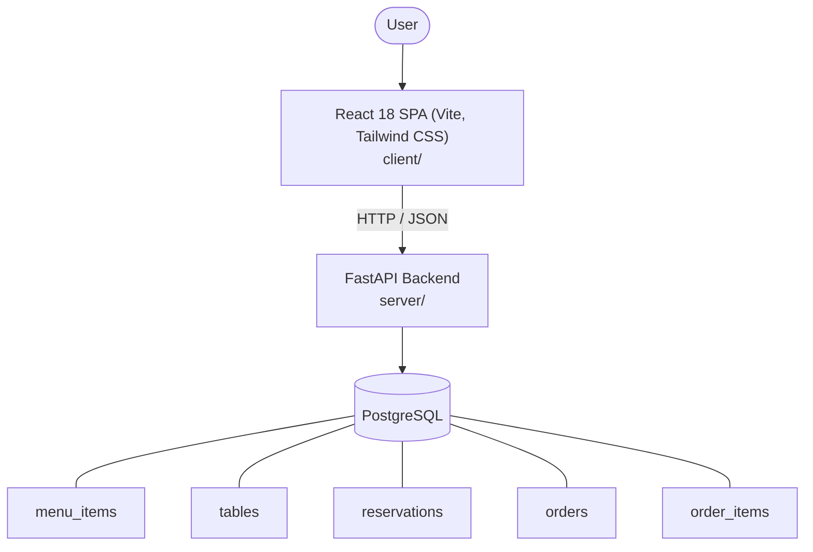

# Architecture

_Auto-generated by the SDLC Assistant from the generated codebase and the approved Feature Spec (latest: SCRUM-214). Regenerated on each push._

## System Diagram

## Tech Stack
- **language**: Python 3.11
- **backend_framework**: FastAPI
- **orm**: SQLAlchemy 2.x
- **database**: PostgreSQL
- **frontend**: React 18 SPA (Vite, Tailwind CSS)
- **cloud_provider**: Google Cloud Platform (GCP)
- **constitution_section_4_followed**: True

## Backend Modules (server/)
- server/__init__.py
- server/api/__init__.py
- server/api/dashboard.py
- server/api/menu.py
- server/api/orders.py
- server/api/tables.py
- server/database.py
- server/main.py
- server/models.py
- server/schemas.py
- server/tests/__init__.py
- server/tests/conftest.py
- server/tests/test_dashboard.py
- server/tests/test_menu.py
- server/tests/test_orders.py
- server/tests/test_tables.py

## Frontend Modules (client/)
- (no client/ files found yet)

## API Endpoints
- GET /api/v1/menu
- POST /api/v1/menu
- PUT /api/v1/menu/{id}
- POST /api/v1/orders
- GET /api/v1/orders
- PATCH /api/v1/orders/{id}/status
- GET /api/v1/tables
- POST /api/v1/tables/reservations
- GET /api/v1/dashboard

## Data Model
- menu_items
- tables
- reservations
- orders
- order_items
