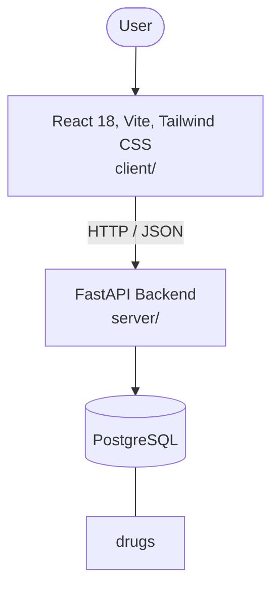

# Architecture

_Auto-generated by the SDLC Assistant from the generated codebase and the approved Feature Spec (latest: SCRUM-239). Regenerated on each push._

## System Diagram

## Tech Stack
- **language**: Python 3.11
- **backend_framework**: FastAPI
- **orm**: SQLAlchemy 2.x
- **database**: PostgreSQL
- **frontend**: React 18, Vite, Tailwind CSS
- **cloud_provider**: Google Cloud Platform (GCP)
- **constitution_section_4_followed**: True

## Backend Modules (server/)
- server/__init__.py
- server/app/__init__.py
- server/app/api/__init__.py
- server/app/api/v1/__init__.py
- server/app/api/v1/drugs.py
- server/app/config.py
- server/app/database.py
- server/app/main.py
- server/app/models/__init__.py
- server/app/models/drug.py
- server/app/schemas/__init__.py
- server/app/schemas/drug.py
- server/app/services/__init__.py
- server/app/services/drug_service.py
- server/tests/__init__.py
- server/tests/conftest.py
- server/tests/test_drugs.py

## Frontend Modules (client/)
- (no client/ files found yet)

## API Endpoints
- GET /api/v1/drugs
- POST /api/v1/drugs
- GET /api/v1/drugs/{id}
- PUT /api/v1/drugs/{id}
- DELETE /api/v1/drugs/{id}

## Data Model
- drugs
