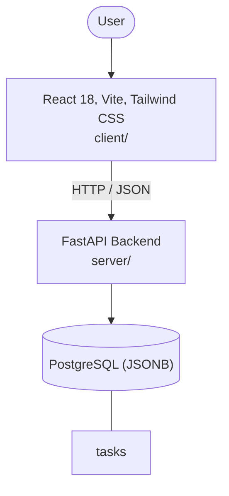

# Architecture

_Auto-generated by the SDLC Assistant from the generated codebase and the approved Feature Spec (latest: SCRUM-45). Regenerated on each push._

## System Diagram

## Tech Stack
- **language**: Python 3.11
- **backend_framework**: FastAPI
- **orm**: SQLAlchemy 2.x
- **database**: PostgreSQL (JSONB)
- **frontend**: React 18, Vite, Tailwind CSS
- **cloud_provider**: GCP Cloud Run
- **constitution_section_4_followed**: True

## Backend Modules (server/)
- server/__init__.py
- server/api/__init__.py
- server/api/v1/__init__.py
- server/api/v1/auth.py
- server/api/v1/tasks.py
- server/auth.py
- server/database.py
- server/main.py
- server/models.py
- server/schemas.py
- server/services/__init__.py
- server/services/task_engine.py
- server/tests/__init__.py
- server/tests/conftest.py
- server/tests/test_auth.py
- server/tests/test_tasks.py

## Frontend Modules (client/)
- client/eslint.config.js
- client/postcss.config.js
- client/src/components/layout/Navbar.jsx
- client/src/components/tasks/EscalationAlertBanner.jsx
- client/src/components/tasks/FailedStateShowcase.jsx
- client/src/components/tasks/InitiateTaskForm.jsx
- client/src/components/tasks/LiveTaskBanner.jsx
- client/src/components/tasks/TaskAuditTable.jsx
- client/src/components/tasks/TaskDetailCard.jsx
- client/src/hooks/useTaskTracker.js
- client/src/main.jsx
- client/src/pages/LiveTaskMonitorPage.jsx
- client/src/pages/TaskDashboardPage.jsx
- client/src/pages/TaskHistoryPage.jsx
- client/src/services/api.js
- client/src/setup.js
- client/src/tests/TaskDashboard.test.jsx
- client/src/tests/useTaskTracker.test.js
- client/tailwind.config.js
- client/vite.config.js

## API Endpoints
- POST /api/v1/tasks
- GET /api/v1/tasks/{task_id}/status
- WS /api/v1/ws/tasks/{task_id}

## Data Model
- tasks
