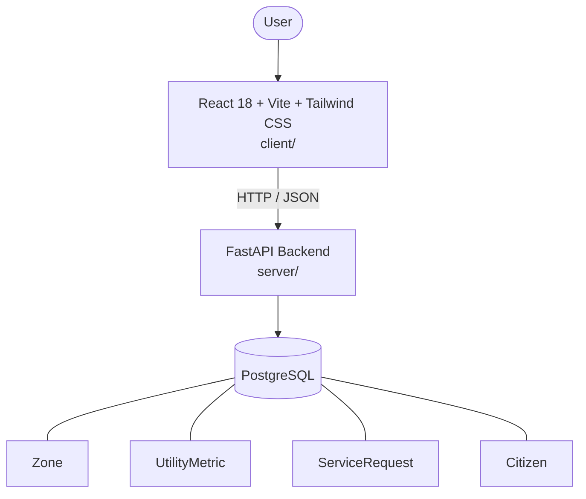

# Architecture

_Auto-generated by the SDLC Assistant from the generated codebase and the approved Feature Spec (latest: SCRUM-240). Regenerated on each push._

## System Diagram

## Tech Stack
- **language**: Python 3.11
- **backend_framework**: FastAPI
- **orm**: SQLAlchemy 2.x
- **database**: PostgreSQL
- **frontend**: React 18 + Vite + Tailwind CSS
- **cloud_provider**: GCP
- **constitution_section_4_followed**: True

## Backend Modules (server/)
- server/__init__.py
- server/app/__init__.py
- server/app/api/__init__.py
- server/app/api/v1/__init__.py
- server/app/api/v1/citizens_router.py
- server/app/api/v1/health_router.py
- server/app/api/v1/service_requests_router.py
- server/app/api/v1/zones_router.py
- server/app/database.py
- server/app/models/__init__.py
- server/app/models/citizen.py
- server/app/models/service_request.py
- server/app/models/utility_metric.py
- server/app/models/zone.py
- server/app/schemas/__init__.py
- server/app/schemas/citizen.py
- server/app/schemas/service_request.py
- server/app/schemas/utility_metric.py
- server/app/schemas/zone.py
- server/app/services/__init__.py
- server/app/services/citizen_service.py
- server/app/services/service_request_service.py
- server/app/services/zone_service.py
- server/main.py
- server/tests/__init__.py
- server/tests/conftest.py
- server/tests/test_citizens.py
- server/tests/test_health.py
- server/tests/test_service_requests.py
- server/tests/test_zones.py

## Frontend Modules (client/)
- (no client/ files found yet)

## API Endpoints
- GET /api/v1/zones
- GET /api/v1/zones/{zone_id}/utility-metrics
- POST /api/v1/service-requests
- GET /api/v1/service-requests
- PATCH /api/v1/service-requests/{request_id}/status
- POST /api/v1/citizens

## Data Model
- Zone
- UtilityMetric
- ServiceRequest
- Citizen
